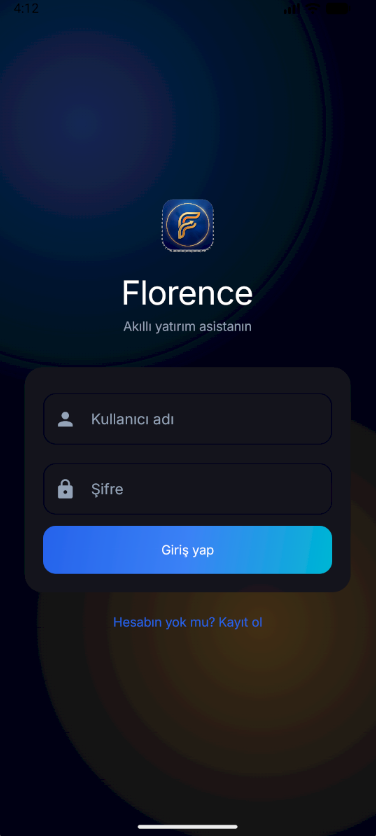
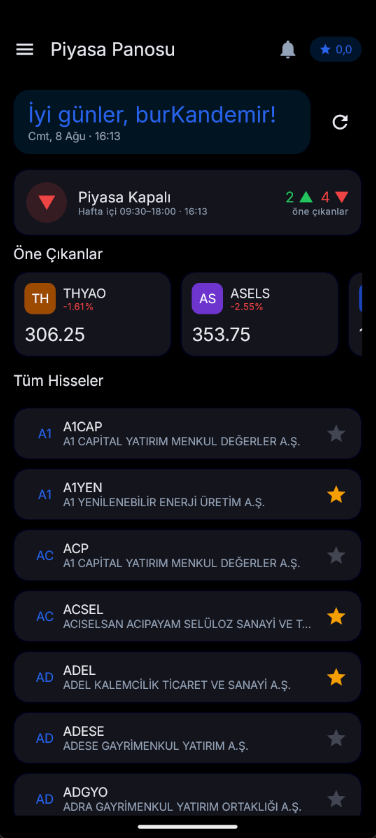
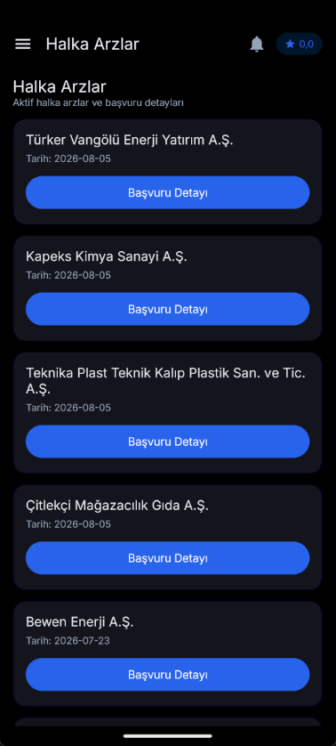
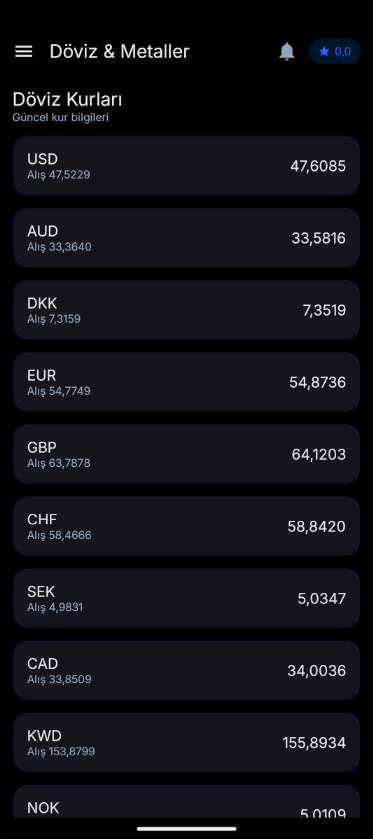
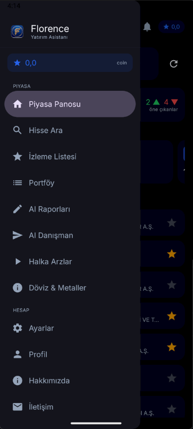
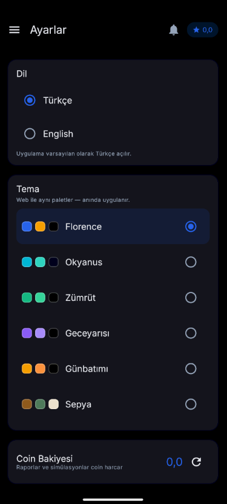
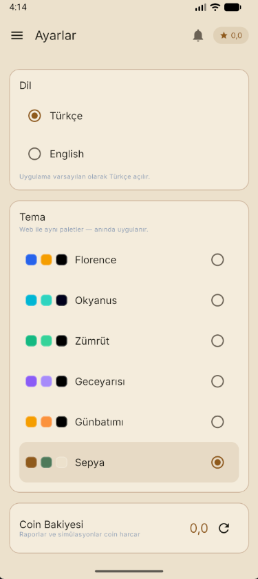
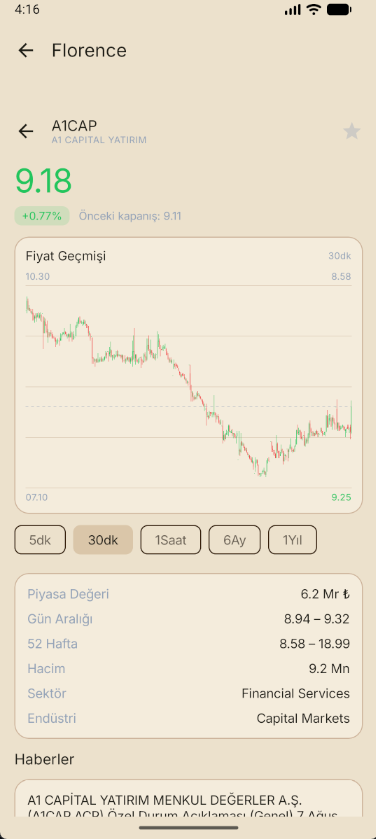
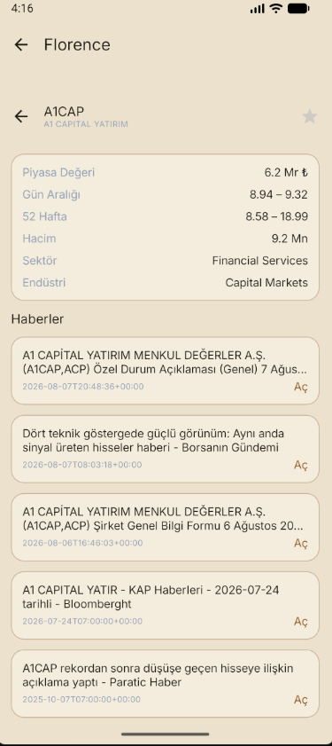

# Florence Mobile (Android)

<div align="center">

**Florence yatırım platformunun native Android uygulaması** — canlı BIST piyasa verisi, döviz & kıymetli metaller, yapay zekâ destekli araştırma raporları ve sanal portföy simülatörü.

[](https://kotlinlang.org)
[](https://developer.android.com/jetpack/compose)
[](https://developer.android.com/studio/publish)
[](LICENSE)

</div>

Florence Mobile, [Florence web arayüzünün](https://github.com/project-florence/web) ve [Florence backend'inin](https://github.com/project-florence/backend) mobil karşılığıdır. Aynı `/api/v1` uçlarını kullanır, aynı paylaşılan veritabanına bağlanır ve web uygulamasıyla birebir aynı davranır — hesaplar, portföyler, krediler ve raporlar iki platformda da aynı şekilde çalışır.

## ✨ Özellikler

- **Canlı BIST panosu** — piyasa durumu, en çok hareket edenler, mini grafikli popüler hisseler
- **Hisse arama & detay** — şirket temel verileri, saf Compose Canvas ile çizilen interaktif mum grafikleri (üçüncü parti grafik kütüphanesi yok)
- **Döviz & Metaller** — resmi TCMB kurları (gold-api yedekli); altın türleri (gram, çeyrek, yarım, tam…), gümüş, platin, paladyum
- **Yapay Zekâ Raporları** — yerel LLM ile (Ollama, `qwen2.5:7b`) hızlı & derin raporlar; internet LLM gerektirmez; kredi maliyeti önceden gösterilir
- **Sanal Portföy** — gerçek zamanlı piyasa fiyatlarıyla al/sat simülasyonu, pozisyonlar, kâr-zarar ve işlem geçmişi
- **Coin / Kredi Sistemi** — bakiye panoda görünür, rapor üretimiyle harcanır, admin uçlarıyla yüklenir
- **İzleme Listesi (Favoriler)** — hisseleri tek dokunuşla takip et
- **Halka Arzlar** — yaklaşan ve güncel halka arzlar
- **Bildirimler** — bildirim merkezi ekranı
- **Çok Dilli & Tema** — varsayılan Türkçe, İngilizce seçeneği; açık/koyu tema
- **Çekmece (drawer) menüsü** özel uygulama logosuyla; açılış ve giriş ekranları
- **Dev / Prod build türleri** — yerel backend (`10.0.2.2:7055`) ve canlı API

## 📸 Ekran Görüntüleri

| | | |
|-|-|-|
|  |  |  |
|  |  |  |
|  |  |  |

## 🛠 Teknoloji Yığını

- **Kotlin 2.x** + **Jetpack Compose** (Material 3), Navigation Compose
- **Hilt** bağımlılık enjeksiyonu, **KSP** kod üretimi
- **Retrofit + OkHttp + kotlinx.serialization** — tip güvenli API katmanı
- **EncryptedSharedPreferences** — refresh token deposu; access token bellekte tutulur
- **MVVM + Repository** mimarisi, tek seferlik (single-flight) token yenileme
- **Saf Compose Canvas** ile tüm grafikler (üçüncü parti grafik bağımlılığı yok)
- minSdk 26 / targetSdk 36

## 🏗 Mimari

```
app/src/main/java/com/florence/app/
├── core/          # ağ (interceptor/authenticator), token deposu, tema, DI
├── data/          # Retrofit API arayüzü, DTO'lar, repository'ler
└── presentation/  # Compose ekranlar, ViewModel'ler, navigasyon
```

API katmanı saf Kotlin + kotlinx.serialization ile ayrıştırılmıştır; ileride iOS hedeflenirse KMP modülüne taşınabilir.

## 🚀 Başlangıç

### Ön koşullar

- JDK 21 (Android Studio JBR) — `gradle.properties` içindeki `org.gradle.java.home` ile ayarlanır
- Android SDK
- `7055` portunda çalışan Florence backend (ayrıntılar için [backend deposu](https://github.com/project-florence/backend))

### Derleme

```bash
# Dev türü (yerel backend: http://10.0.2.2:7055)
./gradlew :app:assembleDevDebug

# Prod türü
./gradlew :app:assembleProdDebug
```

> Windows notu: `GRADLE_USER_HOME` değeri `C:/gradle-home` olarak sabitlenmiştir (`gradlew` içinde) ve proje apostrophesiz bir yolda tutulur; çünkü `GAMER'S` kullanıcı klasörü Java'nın @argfile ayrıştırmasını bozar.

### Emülatörde yerel backend

Backend Docker Compose ile `7055` portunda çalışıyorsa emülatör `10.0.2.2:7055` üzerinden erişir. Alternatif olarak:

```bash
adb reverse tcp:7055 tcp:7055   # ardından localhost:7055 kullanılabilir
```

Cleartext HTTP yalnızca dev hostları için serbesttir (`res/xml/network_security_config.xml`).

## 🔐 Kimlik Doğrulama (backend uyumlu)

- Giriş: `POST /api/v1/auth/login` — **form-encoded** (`OAuth2PasswordRequestForm`), JSON token çifti döner
- Access token 1 saat geçerli; `TokenRefreshAuthenticator` 401'de tek seferlik (single-flight) yenileme yapıp isteği tekrar dener
- Yenileme: `POST /api/v1/auth/refresh` (JSON `{ refresh_token }`) — backend rate limiti 5 istek/dk
- Web ile aynı hesaplar: tek `users` tablosu, platform ayrımı yok

## ✅ Testler

```bash
./gradlew :app:testDevDebugUnitTest
```

## 📄 Lisans

AGPL-3.0 — ayrıntılar için [LICENSE](LICENSE).
